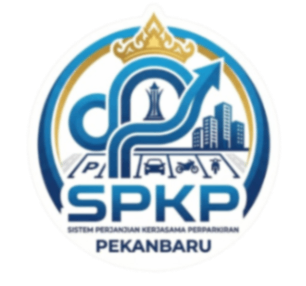

<h1 align="center">
  <br>
  Sistem Informasi Manajemen Perparkiran Terpadu (SiPKS)
</h1>

<h4 align="center">Enterprise-Grade Parking Management & Collaboration System</h4>

<p align="center">
  
  
  
  
</p>

<p align="center">
  <b>SiPKS (Sistem Parkir Terpadu)</b> adalah mahakarya arsitektur perangkat lunak yang dirancang eksklusif untuk mendigitalisasi tata kelola perparkiran pada <b>Dinas Perhubungan / UPT Perparkiran Kota Pekanbaru</b>. Menghadirkan keseimbangan sempurna antara keamanan tingkat tinggi, manajemen data presisi, dan antarmuka pengguna ultra-premium.
</p>

---

## 🌟 Fitur Premium & Kemampuan Sistem

SiPKS bukan sekadar aplikasi pencatatan, melainkan instrumen cerdas yang memadukan otomasi proses bisnis dengan _user experience_ (UX) modern.

- 📊 **Executive Dashboard Interaktif**
  Visualisasi _real-time_ berbasis ApexCharts & Chart.js. Dilengkapi navigasi cerdas—klik grafik untuk melompat langsung ke rincian spesifik (analisis detail ruas jalan penyumbang setoran terbesar).
  
- 📄 **Digitalisasi Dokumen & PKS Terpadu**
  Otomatisasi pembuatan _Draft_ Perjanjian Kerjasama (PKS) ke dalam format PDF berstandar tinggi. Dilengkapi Generator QR Code berlapis keamanan _10-char Alphanumeric_ dengan _watermark_ instansi. Export data luas ke format Excel.

- 🗺️ **Sistem Informasi Geografis (GIS)**
  Pemetaan presisi tinggi menggunakan **Leaflet.js** & **Mapbox GL**. Memantau koordinat setiap lahan parkir lengkap dengan status aktif, masa berlaku PKS, dan performa retribusi secara spasial.

- 💳 **Akuntansi & Rekonsiliasi Deposit BLUD**
  Modul manajemen keuangan tingkat _enterprise_ yang melacak kalkulasi setoran harian/bulanan koordinator, membandingkannya dengan target tahunan, dan mengintegrasikannya dengan buku rekening BLUD daerah.

- 📅 **Manajemen Jadwal & Penugasan (FullCalendar)**
  Penjadwalan petugas di lapangan dan manajemen masa berlaku PKS divisualisasikan dengan apik menggunakan integrasi FullCalendar 6.

- 🔒 **Arsitektur Keamanan Berlapis (RBAC 5-Level)**
  Sistem otonomi wewenang presisi (Admin, Pimpinan, Bendahara, Staff PKS, Staff Keuangan). Dilengkapi sistem proteksi anti-IDOR, Laravel Sanctum, dan enkripsi OTP WhatsApp _passwordless recovery_.

- 💎 **Premium UI & M3 Animations**
  Menerapkan standar desain web mutakhir dengan **Vuexy Admin Template**. Mulai dari formulir responsif (_DataTables, SweetAlert2, Dropzone, Flatpickr_), hingga halaman _error_ berhiaskan efek kaca buram (_frosted glass_).

---

## 🛠️ Ekosistem Teknologi & Stack

Aplikasi ini ditenagai oleh kombinasi teknologi terbaik di kelasnya untuk menjamin stabilitas dan skalabilitas:

<div align="center">
  <table>
    <tr>
      <th align="center"><b>Backend & Core</b></th>
      <th align="center"><b>Frontend & UI</b></th>
      <th align="center"><b>Database & Tools</b></th>
    </tr>
    <tr>
      <td valign="top">
        • Laravel 12<br>
        • PHP 8.2+ / 8.4+<br>
        • Laravel Sanctum<br>
        • Barryvdh DomPDF<br>
        • Maatwebsite Excel<br>
        • Simple QrCode
      </td>
      <td valign="top">
        • Vuexy Template (Bootstrap 5)<br>
        • Vite 6.x & SCSS<br>
        • DataTables, SweetAlert2<br>
        • ApexCharts, Chart.js<br>
        • Leaflet.js, Mapbox GL<br>
        • FullCalendar 6
      </td>
      <td valign="top">
        • MySQL / MariaDB<br>
        • Fonnte API (WA Gateway)<br>
        • Spatie Backup<br>
        • Git Version Control<br>
        • Ubuntu Server Environment<br>
        • Artisan Console
      </td>
    </tr>
  </table>
</div>

---

## 🚀 Panduan Instalasi (Development)

Bagi pengembang yang ingin menjalankan aplikasi ini di _local environment_:

```bash
# 1. Clone repositori ini
git clone [repository-url]
cd spt-app

# 2. Install dependensi PHP
composer install

# 3. Install dependensi JavaScript (NPM)
npm install

# 4. Konfigurasi Environment
cp .env.example .env
php artisan key:generate

# 5. Konfigurasi Database di file .env, kemudian jalankan migrasi
php artisan migrate --seed

# 6. Buat symbolic link untuk storage
php artisan storage:link

# 7. Build aset frontend via Vite
npm run build
# atau untuk mode development: npm run dev

# 8. Jalankan local server
php artisan serve
```

---

## 👨‍💻 _The Architect_

<p align="center">
  
</p>

Sistem ini dirancang dan dikembangkan sepenuhnya oleh **Bangameck** di bawah bendera **RadevankaProject**. Fokus utama saya adalah menciptakan perangkat lunak yang tidak hanya berfungsi memecahkan masalah kompleks (_Enterprise & Government Scale_), tetapi juga memberikan pengalaman visual yang memanjakan mata.

<p align="center">
  <a href="https://github.com/bangameck">
    
  </a>
  <a href="https://instagram.com/bangameck">
    
  </a>
  <a href="https://tiktok.com/@bangameck.dev">
    
  </a>
</p>

### 💼 _Available for Collaboration_
Menerima pembuatan _Enterprise System_, MVP Startup, _Government Project_, hingga Aplikasi Mobile terintegrasi _Biometric/GPS_.

📱 **WhatsApp**: +62 822-8844-5265 <br>
📧 **Email**: `radevankaproject@gmail.com`

---

<p align="center">
  <i>"Build with logic. Secure with discipline. Deliver with pride."</i><br>
  <b>— Bangameck • 🚀 RadevankaProject</b>
</p>
